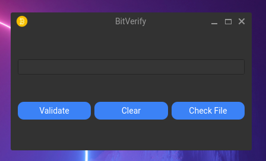

# BitVerify: Offline Bitcoin Address Validator

PyQt6 Version of **[BITVERIFY](https://github.com/ryd3v/bitverify)**

V1.0.0

## Overview

BitVerify is a desktop application built with Python and PyQt6 for validating Bitcoin addresses. The application
supports P2PKH, P2SH, and Bech32 address types and offers both light and dark modes for better user experience.



## Features

- Validate P2PKH, P2SH, and Bech32 Bitcoin addresses
- Light and Dark Mode support
- Simple and intuitive GUI
- Error popups for invalid addresses
- Open-source

## Requirements

- Python 3.6+
- PyQt6
- Qt Designer (optional)

## Installation

1. Clone the repository:
    ```
    git clone https://github.com/yourusername/bitverify.git
    ```
2. Navigate to the project directory:
    ```
    cd bitverify
    ```
3. Install the requirements:
    ```
    pip install -r requirements.txt
    ```
4. Run the application:
    ```
    python bitverify.py
    ```

## Usage

1. Enter a Bitcoin address in the input field.
2. Click the "Validate" button to check the validity of the address.
3. A popup will appear to indicate whether the address is valid or not.
4. Use the "Toggle Theme" button to switch between light and dark modes.

## Contributing

Pull requests are welcome. For major changes, please open an issue first to discuss what you would like to change.

## License

[MIT](https://choosealicense.com/licenses/mit/)
